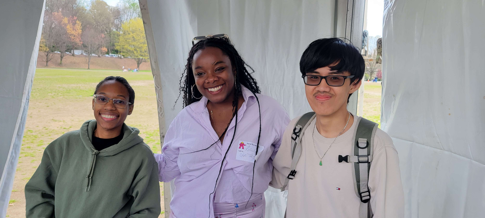

# BlendingReality

## Description
* Difficulty Level: Medium
* Target Audience: 6th Grade - College
* Duration of workshop: 60-90 minutes
* Needed Materials: Computers with Blender and Adobe Aero Desktop version downloaded on them as well as phones with the mobile verson of Adobe Aero downloaded.
* The primary goal of this project is educating others about Augmented Reality (AR) using Adobe Aero and 3D Modeling using Blender.
  
  This project is geared towards educating and creating interest in the IT field for non STEM majors. By engaging in our workshop, students will get to experiment with Blender, 3D modeling and AR, which allows them to learn about how to play with AR technology. 
* The Technology Ambassador Program ([TAP](https://www.ggc.edu/academics/school-of-science-and-technology/research-internships-service-learning/technology-ambassador-program)) at GGC strives to break the misconceptions of the IT field by providing fun workshops for students of all backgrounds. TAP students design engaging and fun outreach workshops to encourage interest in IT and STEM.

  ## Team
  Kelechi Ariwodo, 
  Thien Nghi Duong, 
  Carina George
  
  ### Advisors
  Dr. Anca Doloc Mihu, 
  Dr. Cindy Robertson

  ### Team Photo
  

  ## Publication
  1. Kelechi Ariwodo, Thien Nghi Duong, Carina George. Teaching Blender and Adobe Aero, ACMSE April 18-20 2024, Kennesaw State University

  ## Outreach Activities
 1. TAP Expo, 2024, Georgia Gwinnett College
 2. [Atlanta Science Festival](https://www.atlantasciencefestival.org), 2024, Piedmont Park
 3. Class Workshops, 2024, Georgia Gwinnett College
    
  ## Technology
  This workshop will be using Blender and Adobe Aero for both desktop as well as mobile  
     
     
      
    * Blender Download: https://www.blender.org/download/  
    * Adobe Aero Download: https://helpx.adobe.com/aero/get-started.html#:~:text=Download%20and%20install&text=Click%20Get%20Aero%20Player%20(beta,the%20onscreen%20instructions%20to%20install.&text=Click%20Get%20Aero%20on%20the,to%20sign%2Din%20and%20install.

## Short demo instructions
(Make short youtube video to place here 
Example: https://www.youtube.com/watch?v=W7AJaQqIAE0)
 
## Workshop Instructions

      
## Project setup/Installation
### Installing Blender  
For instructions on how to install Blender please use the pdf file linked below.  

### Creating a Teacher Sphero Account 
For instructions on how to create a teacher sphero account please use the pdf file linked below.  

### Creating a Classroom and Adding Students in Sphero Edu
For instructions on how to create a classroom and add students please use the pdf file linked below.  

### Creating a Program in Sphero Edu
For instructions on how to create a program please use the pdf file linked below.  

### Construction
For instructions on how to build the maze please use the pdf file linked below.  

## Short demo instructions
Below is a link to a 5 minute video walkthrough of our workshop that anyone with a sphero can do.  
https://youtu.be/W7AJaQqIAE0
## Workshop Instructions

